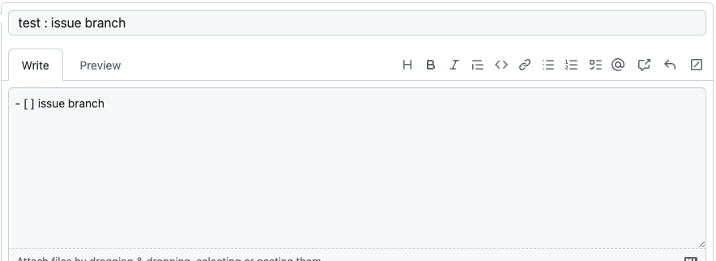
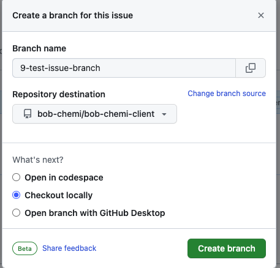
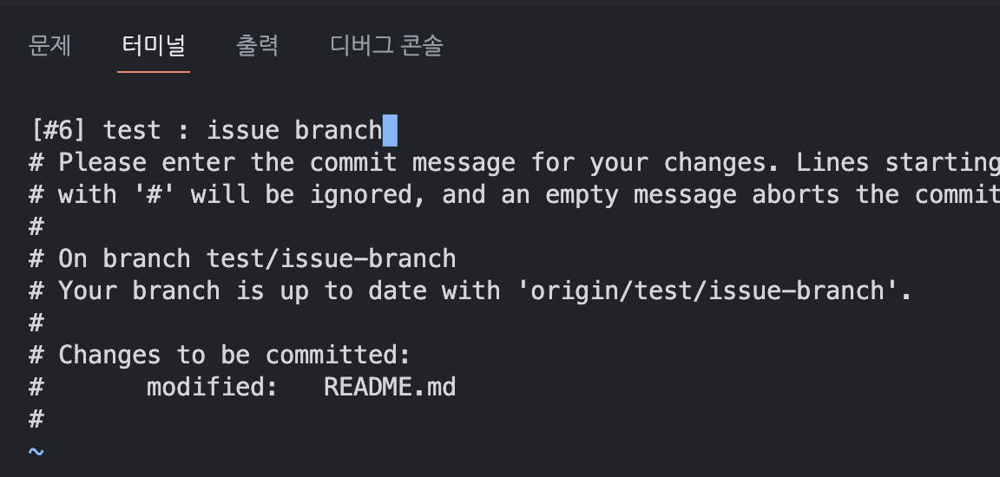

# Bob-Chemi-Client

## 팀 소개

|  |  |  |
| ----------------------------------------------------------------- | ----------------------------------------------------------------- | ----------------------------------------------------------------- |
| <a href="https://github.com/Strongorange">이찬휘</a>              | <a href="https://github.com/Juhyun34">김주현</a>                  | <a href="https://github.com/sacultang">오영재</a>                 |

## 📜 목차

- [프로젝트 개요](##프로젝트-개요)
- [기술 스택](##기술-스택)
- [팀 규칙](##팀-규칙)
  - [Commit 규칙](###Git-commit-convention)
  - [Branch/Pull Request형식](##Branch/Pull-Request형식)
  - [변수/파일 이름 규칙](##변수/파일-이름-규칙)
- [폴더 구조](##프로젝트-개요)

## 📬 프로젝트 개요

<aside>
💡 혼밥하는 사람들을 위한 번개매칭 시스템, 소모임을 통해 맛집을 공유,

</aside>

## 기술 스택

<div>


</div>
<br>

## 팀 규칙

### Git commit convention

- feat : 새운운 기능 추가
- fix : 버그 수정
- docs : 문서 수정
- style : 코드 포맷팅, 세미콜론 누락, 코드 변경이 없는경우
- refactor : 코드 리팩토링
- test : 테스트 코드, 리팩토링 테스트 코드 추가
- chore : 빌드 업무, 패키지 매니저 수정, 잡다...

### Branch/Pull Request형식

- Branch 이름  
  
  
  

```text
issueNumber-(type)-issue제목

# types
- feature : 새로운 기능 추가
- fix : 버그 수정
- docs : 문서 관련
- refactor : 코드 리팩토링
- test : 테스트 코드
- chore : 빌드 업무 수정, 패키지 매니저 수정 등
- merge : 브랜치 합치기
```

- Pull Request형식

```text
제목: commit message와 동일
설명: 특이사항 없을 시 기입 안함
```

### 변수/파일이름 규칙

- 변수/유틸/hooks 이름 : **camelCase** → `handleClick()` `utils.ts` `useHooks.ts`
- 컴포넌트 이름 : **PascalCase** → `Component.tsx`

## 폴더 구조

```text

└─ src
    ├─ api
    │   └─ base.js
    ├─ components
    ├─ hooks
    ├─ navigations
    ├─ screens
    │     └─ home
    │         ├─ hooks
    │         ├─ components
    │         ├─ style
    │         └─ home.tsx
    ├─ utils
    ├─ styles
    │   └─ globalStyle.ts
    └─ App.tsx
```
